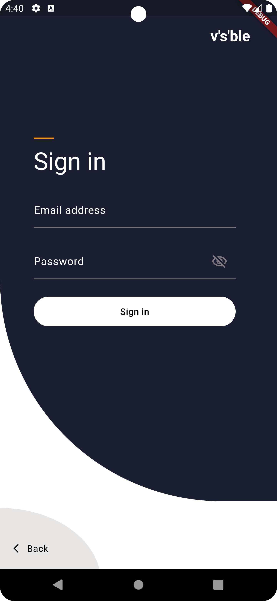
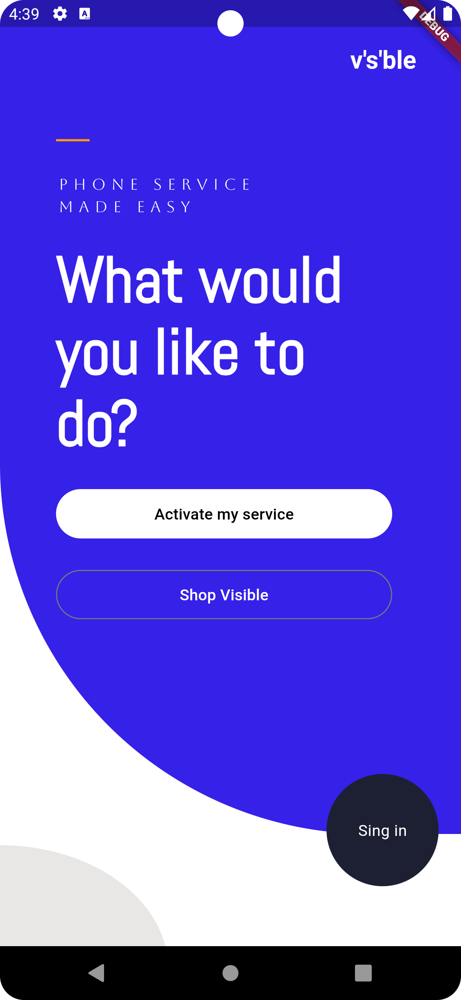

# Flutter Beautiful UI App

This is a Flutter application showcasing a beautifully designed Login and Initial Page UI. The project is structured to provide an elegant interface with smooth transitions and user-friendly interactions. The UI components are responsive, ensuring a seamless experience across various devices.

## 📱 Screenshots




## 🚀 Features

- ✨ Beautiful and responsive login screen UI.
- 🖥️ Elegant initial page UI after login.
- 🔑 Customizable for different authentication flows.
- 🌐 Supports all screen sizes and orientations.

## 🛠️ Installation and Setup

To clone and run this application, you'll need [Git](https://git-scm.com), [Flutter](https://flutter.dev), and [Dart](https://dart.dev) installed on your machine.

### Prerequisites

Make sure you have Flutter SDK and its dependencies installed. You can find the installation guide for Flutter [here](https://flutter.dev/docs/get-started/install).

### Clone the Repository

Open a terminal and execute the following command:

```bash
git clone https://github.com/mahesh1071997/login_ui.git
